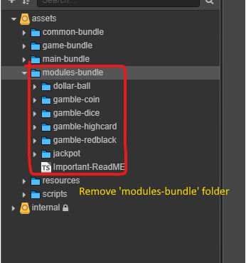
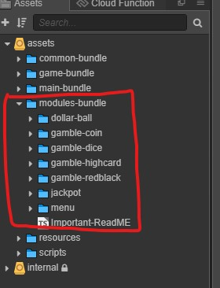

# Super-Template v1.1.1

The Super-Template objective to simplify slot game development. It still in early stage development and release, so it may contain bugs and a lot stuff to improvement. It will do update every **2-4 weeks**. Any issue and feedback are welcome to let us know.

---

Super-template subject to change from time to time when:

- New game requirement or changes request
- Api integration (_ignore current result structure, real API maybe be different from this_)
- Super-Template improvement or bugs fix
- To-do list

## Update

### v1.1.1 (3-August-2021) [download](https://github.com/GT3-Game/super-template-docs/tree/main/resources/cocos-creator/update)

- Added modules-config.json handler
- Added Insufficient Balance Message
- Added GlobaData.ts
- Fixed issue when showing help-information panel still able to spin using keyboard space key
- Fixed Incorrect Balance Display
- Fixed Post big win sfx need to cut when reset function apply
- Remove 'modules-bundle' folder
- Update API http to https

### v1.1.0 (12-July-2021) [download](https://github.com/GT3-Game/super-template-docs/tree/main/resources/cocos-creator/update)

- Added Dynamic Modules Loader
- Added Fullsceeen Control
- Added GameServer Manager to Call API
- Update Swipe and Spin Feature
- Bugs Fixed
- Super-Template now separate and hosting `modules-bundle` with another project.
- Every module inside `modules-bundle` will get through http request.
- `modules-bundle` now will maintain by GT3 team.
