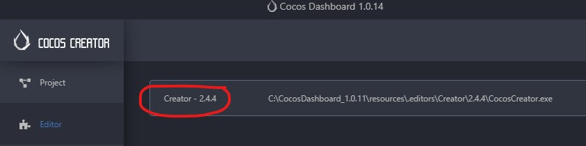
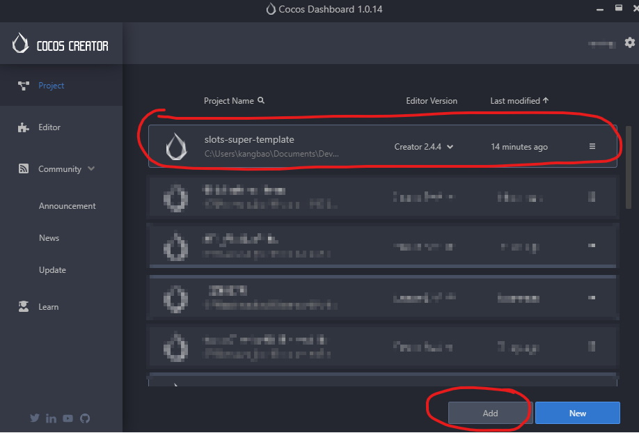

# Installation and Setup of Super-Template

Getting Super-Template installed and ready-to-go should only take a few minutes.

## Local Installation

##### Requirements

1. Clone the [Super-Template](https://code.visualstudio.com/download) from Github.

2. Install [NodeJS](https://nodejs.org/en/), Install all npm dependencies package
   ```
   # Install all dependencies of this project (the project only depends on TypeScript + ESLint related dependencies, used to standardize the project and improve code quality)
   npm i --save-dev
   ``` 
3. It is recommended to use [Visual Studio Code](https://code.visualstudio.com/download) as the code editor. 

4. Requirement install the VSCode plugin *ESLint* and *Prettier*. After the installation is complete, open VSCode `settings.json` (Ctrl + Shirt + P to open settings (JSON))，paste the following code
    ```
    "eslint.alwaysShowStatus": true,
    "eslint.format.enable": true,
    "eslint.validate": [
        "javascript",
        "javascriptreact",
        "typescript",
        "typescriptreact"
    ],
    "editor.defaultFormatter": "esbenp.prettier-vscode",
    "editor.formatOnSave": true,
    "search.exclude": {
        "**/node_modules": true,
        "**/bower_components": true,
        "build/": true,
        "temp/": true,
        "library/": true,
        "**/*.anim": true
    },
    "files.exclude": {
        "**/.git": true,
        "**/.DS_Store": true,
        "**/*.meta": true,
        "library/": true,
        "local/": true,
        "temp/": true
    }
   ``` 

Install plugins and where to open `settings.json` as bellow show.
 

 Make sure plugins is enable in project as bellow show.
 

5.	Recommended to use [Google TypeScript style guide](https://google.github.io/styleguide/tsguide.html)

6.	Please make sure projects is RUNNABLE and NO ERROR when in local preview 


## Setup Cocos Creator

1. Download Cocos Creator version 2.4.4


2. Add Super-Template project to Cocos Dashboard


3. Replace default Cocos Creator `index.html`. Backup default index.html just in case. [Download]()

 3.1 Click 'App' to open Cocos Creator folder

    
 3.2 Find the `index.html` at bellow location and replace it
