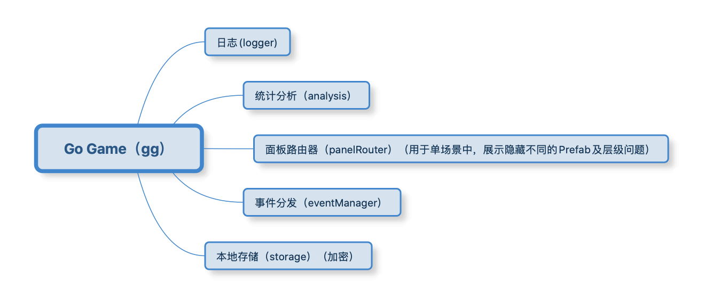

# Cocos Creator GG Framework

[](http://www.cocos.com/creator)

**Disclaimer and Notices**

GT3-Super-Template is built based on [github.com/zhitaocai/CocosCreator-GG-Framework](https://github.com/zhitaocai/CocosCreator-GG-Framework) used under the MIT license.

Note: This just an explanation what is Cocos Creator GG Framework, *Super-Template are modified from this framework to fit business need*.

Cocos Creator GG Framework is a framework for quickly building and running games, meaning Go Game!



The GG framework uses TypeScript language and is based on the structure of **single scene + multiple Prefab**. The entrance to the framework is `gg`, you only need to enter `gg.` in the editor to learn about the usage and meaning of all APIs of the framework through the prompts of the Visual Studio Code editor, which is very convenient to get started.

Now, Go Game!

## 1. Project detailed introduction

The project infrastructure is **single scene + multiple Prefab**. among them,

* Different Prefabs will be organized through AssetBundle to form modules. Decoupling the purpose of forming modules to improve reusability and facilitate cross-project use
* When used across projects, our data structure and logic can basically be reused, only the UI may be different

Project structure overview:

```
assets
┣━━ mainbundle (This is a folder and does not need to be configured as a bundle. After packaging, it will become a built-in main Bundle. Bundle priority: 7)
┃    ┣━━ scenes
┃    ┃   ┗━━ MainScene.fire (Main scene)
┃    ┗━━ scripts
┃        ┣━━ configs
┃        ┃   ┣━━ BundleConfigs.ts (Record all Bundle configuration scripts)
┃        ┃   ┗━━ PanelConfigs.ts (Record all panel configuration scripts)
┃        ┗━━ MainSceneCtrl.ts (Main scene entry logic script)
┣━━ commonbundle (Common module bundle priority: 6)
┃    ┣━━ prefabs
┃    ┃   ┣━━ boot
┃    ┃   ┃   ┗━━ BootPanelPrefab.prefab (Game launch page board Prefab)
┃    ┃   ┗━━ popwindow
┃    ┃       ┣━━ LoadingPanelPrefab.prefab (Global Universal Loading Panel Prefab)
┃    ┃       ┗━━ ToastPanelPrefab.prefab (Global universal Toast panel Prefab)
┃    ┣━━ scripts
┃    ┃   ┣━━ boot
┃    ┃   ┃   ┗━━ BootPanelPrefab.ts (The control script of the game launch page board Prefab)
┃    ┃   ┗━━ popwindow
┃    ┃       ┣━━ LoadingPanelPrefab.ts (Control script of Prefab of global universal Loading panel)
┃    ┃       ┗━━ ToastPanelPrefab.ts (The control script of the global universal Toast panel Prefab)
┃    ┗━━ textures
┃        ┗━━ xxx (Self-organizing)
┗━━ gamebundle (Game module bundle priority: 5)
     ┣━━ prefabs
     ┃   ┣━━ game
     ┃   ┃   ┗━━ GamePanelPrefab.prefab (Game main panel Prefab)
     ┃   ┗━━ gamesetting
     ┃       ┗━━ GameSettingPanelPrefab.prefab (Game Settings Panel Prefab)
     ┣━━ scripts
     ┃   ┣━━ game
     ┃   ┃   ┗━━ GamePanelPrefab.prefab (Control script of the game main panel Prefab)
     ┃   ┗━━ gamesetting
     ┃       ┣━━ GameSettingConst.ts (Constant of Game Settings Module)
     ┃       ┣━━ GameSettingEvent.ts(Broadcast event of game setting module)
     ┃       ┣━━ GameSettingModel.ts (Data Model of Game Settings Module)
     ┃       ┣━━ GameSettingModule.ts (Logical control of game setting module)
     ┃       ┗━━ GameSettingPanelPrefab.ts (Control script of game setting panel Prefab)
     ┗━━ textures
         ┗━━ xxx (Self-organized)
```

Description:

1. Except for the `mainBundle` folder, other folders with the suffix of `*bundle` need to be configured as bundles
2. Pay attention to the bundle priority, `mainbundle> commonbundle> gamebundle> ...bundle`
3. The `gamebundle/scripts/gamesetting` in the module structure is a summary [module structure framework] (module structure description.md)
4. To read the project, you need to read from it in `MainSceneCtrl.ts`, and learn about the interface of the `gg.` framework in the process

## 2. Q&A

### 2.1 Why is the structure of **single scene + multiple Prefab**?

* **Convenient to restore page status**
  * Consider a requirement like this: when you switch from page A to page B, and then switch from page B back to page A, page A needs to be restored to the state before page B was opened. For example: the ScrollView of page A before switching is scrolled to 70% position, after switching back, it also needs to be restored to 70% position
  * So,
    * If pages A and B are the structure of the scene, then to achieve such a requirement, you need to write additional state storage and restore state logic, because when you switch from scene A to scene B, scene A is destroyed, and again Need to be restored when opened
    * And if pages A and B are the structure of Prefab, then there is no need to write such logic, just active = true/false switch.
* **Convenient to quickly switch between different Prefabs from the editor**
  * I don't know if you found out. In the editor, when PrefabA is opened and then switched to PrefabB, the process is like this: **Close Prefab A -> Open the current scene -> Open PrefabB**. In this way, if we are a single scene, and the scene is super simple, then the switch from PrefabA to PrefabB will be super fast
* **Convenient to realize switching animation**
  * The switch before the scene is hard cut, there is no animation effect, currently you can use the global node to do cloud merging similar animation effects
  * In the case of Prefab, it is more convenient to do the switching animation. In our framework, it is through ``gg.panelRouter.show/hide`` to switch the Prefab page, and it is very convenient to do the switching animation
* **Convenient for multi-person collaboration**
  * When multiple people collaborate, if multiple people modify the scene at the same time, subsequent merging will become very difficult
  * Would it be better with Prefab? In fact, it won't. If multiple people modify the same Prefab at the same time, subsequent mergers will become very difficult. So why is it still Prefab? Because Prefab can make UI with finer granularity, a large page can be divided into many small Prefabs to make

### 2.2 Why is the startup page not placed in MainScene.scene, but a separate BootPanelPrefab.prefab?

This is to optimize the size of the game. With this design, the size of the game is almost only one scene (without any resource references) + framework script, ensuring a very small first package**. Of course, it doesn't have to be done like this, but the intention of doing it like this means that.


# 3. Project module structure description

In order to **easy for team assistance**, **facilitate business expansion**, and **reuse business logic**, the project adopts a modular structure idea. For example, it can be divided into the following modules:

-   Login module
-   Hall module
-   Game combat module
-   Daily check-in module
-   Mail system module
-   Chat system module
-   ...

In order to facilitate the team to develop multiple UI interfaces at the same time, the project adopts a **single scene + multiple Prefab** structure. The scene is mainly used to mount the UI interface of different modules. The UI interface of each module is composed of the Prefab of the corresponding module. composition.

## 3.1 Module composition

-   **Module Constant Class**: Responsible for defining various constants generated by the module
-   **Module Event Class**: Responsible for defining various event messages generated by the module
-   **Module Data Class**: Responsible for saving and reading data, basically without any other logic
-   **Module logic category**: Responsible for game logic, including network communication, data processing, etc., and is responsible for updating the data in the data category
-   **Module Panel**: Responsible for the display of the interface UI and the prefab associated with the UI. You can read the data in the data class to refresh the UI interface; you can call the methods in the module class to make various processing

## 3.2 Module naming rules

-   Module folder name: `XXX`
-   Module constant class name: `XXXConst.ts`
-   Module event class name: `XXXEvent.ts`
-   Module data class name: `XXXModel.ts`
-   Module logic class name: `XXXModule.ts`
-   Module panel class name: `XXXPanelPrefab.ts`

## 3.3 Module constraints

In each module:

-   **Module logic class** and **Module data class** have and only **one**
-   **Module logic class** is globally accessible
-   **Module panel class** can have **multiple**
-   **Module panel class** can be displayed, hidden, and destroyed directly through the panel router (gg.panelRouter.show/hide/destroy)
-   **Module Panel Class**, **Module Logic Class** of all modules can be directly referenced/used
-   **Module panel class** itself should not be referenced by any **module logic class** and **module data class** (for example: you cannot directly operate the panel of a module through **module logic class** Class) to facilitate the transplantation of **"modules and data except for panels"** to other projects. For example: most of the login, chat, backpack, etc. of the same company can be reused
-   The UI update of the **module panel class** can be registered/unregistered through the `onEnable` and `onDisable` of the Component **events defined by the module event class**. When data is updated and logic changes, broadcast events to drive UI updates

## 3.4 The step process of adding a new module (reference)

1. Create a new directory named by the module in the appropriate bundle, such as `XXX`
2. Create the following files in the `XXX` directory
    - `XXXConst.ts` (optional, if there are constants generated by the module itself, you need to)
    - `XXXEvent.ts` (optional, required if there are events generated by the module itself)
    - `XXXModel.ts` (required)
    - `XXXModule.ts` (required)
    - `XXXPanelPrefab.ts` (optional, required if there is a panel display)

-----------------------------------

Translated using Google Translate

Copyright (c) 2021 GT3


