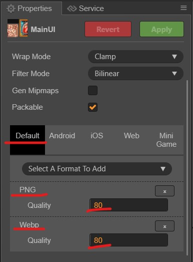
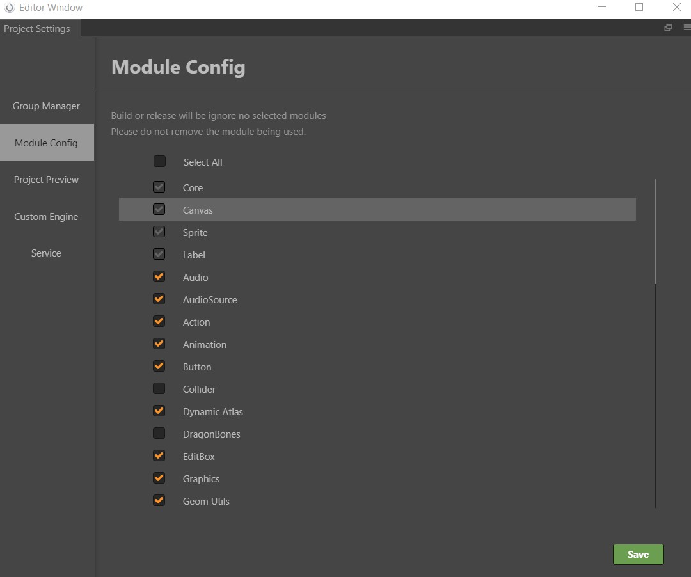

# Optimization

## DrawCall

Reduce DrawCall as much as possible

- [Tutorial: Cocos Creator performance optimization: DrawCall](https://discuss.cocos2d-x.org/t/tutorial-cocos-creator-performance-optmization-drawcall/51425)
- Try to keep the number of draw calls below 50. In short, try to reduce it as much as possible
- Dont do heavy calculations in the game loop, because this may cause a large number of calculations 60 times per frame
- Reduce the use of components that can interrupt combined rendering such as Mask and spine.
- Resource division: Combine atlas according to function or demand, and try to promote combined rendering.
- Strictly control the rendering node tree. Adjacent rendering nodes should come from the same atlas as much as possible, especially the node tree created in recycling.
- If the label content is letters, commonly used symbols, and numbers, you can use the bitmap bmf and merge it into the ui as required to avoid interruption of the merged rendering due to the interspersed rendering of the label.

## Images

Optimize images into smaller size

- Use webp where posible
- Split background into individual background JPG
- Use .jpg where there is no alpha channel is required. JPG size is smaller than PNG
- Utilize lazyloading to reduce images loading when booting game

## Project Module Setting

Remove unnecessary module to reduce Cocos Creator Library file size. 

## Audio

Compress mp3 into smaller size with acceptable quality