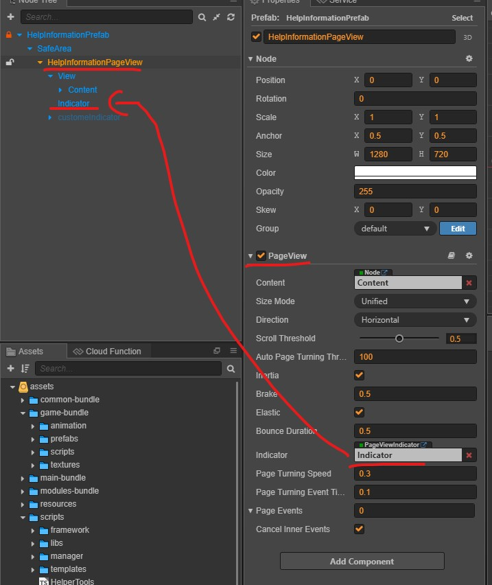
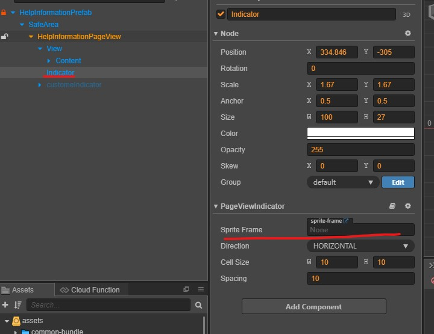
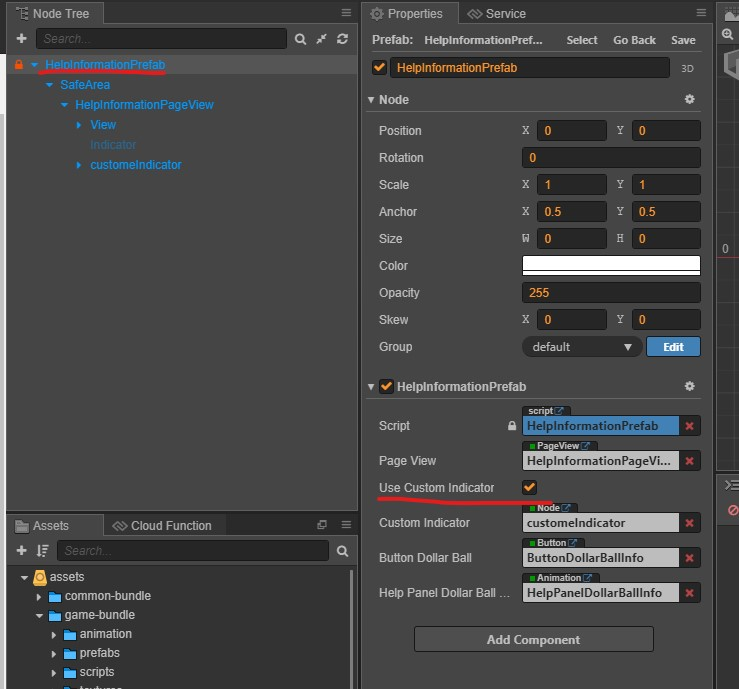
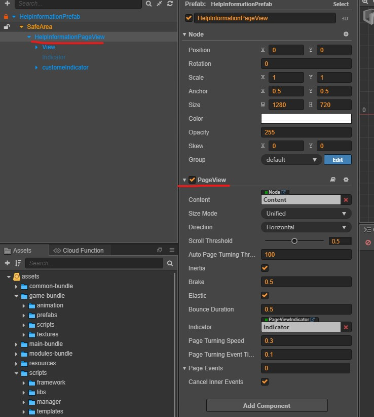
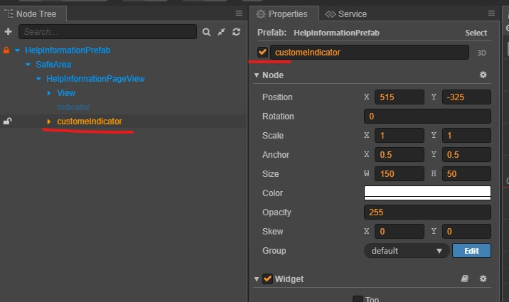

# Help Information Custom Indicator

Help Information come with default and customer indicator

## Default Indicator

##### How to enable default indicator

Enable those settings

Assign indicator images and done

## Custom Indicator

##### How to enable custom indicator

Enable `Use Custom Indicator` in *HelpInformationPrefab*

Enable *PageView* component 

Activate `CustomeIndicator` node and change indicator images in `CustomeIndicator`'s child node
