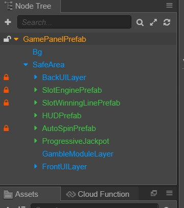
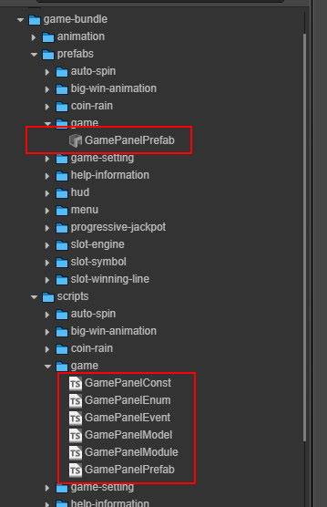
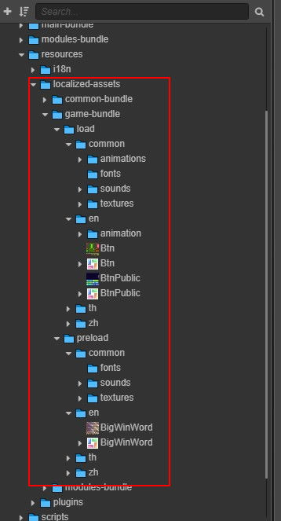
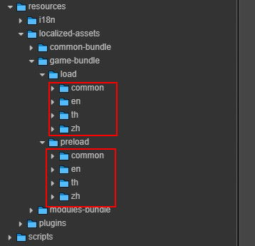

# Prefab and Resources 

## Prefab

Super-Template main prefab `GamePanelPrefab`. We we working everything in this prefab.

Prefabs related to game should place inside `game-bundle` accordingly.

The step process of adding a new module:
1. Create a new directory named by the module in the appropriate bundle, such as `XXX`.
2. Create the following files in the `XXX` directory:
    - `XXXConst.ts` (optional, if there are constants generated by the module itself, you need to)
    - `XXXEvent.ts` (optional, required if there are events generated by the module itself)
    - `XXXModel.ts` (required)
    - `XXXModule.ts` (required)
    - `XXXPanelPrefab.ts` (optional, required if there is a panel display)

## Resources Folder

In Super-Tamplate design, there is required to category and place localized assets, animation, sound effect and more inside `resources` folder.
Dynamic load assets to speed up game load and ready.

What condition that need to place inside `resources` folder?
- Multilingual Assets
- Assets that no required to use immediately
- Fonts that no required to use immediately
- Sound Effects
- Animations

## Load and Preload Folder

Every bundle in `resources` folder contain 2 folder, `load` and `preload`.

`load` folder contain assets that required to load during game started.

`preload` folder contain assets for *Lazyloading*.

Inside `load` and `preload` have particular folder as bellow list:
- `common`
- `en`
- `th`
- `zh`

Please category and place assets inside correct folder.