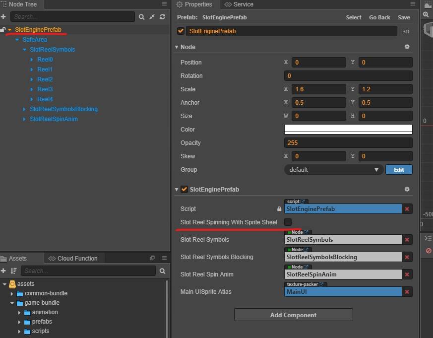
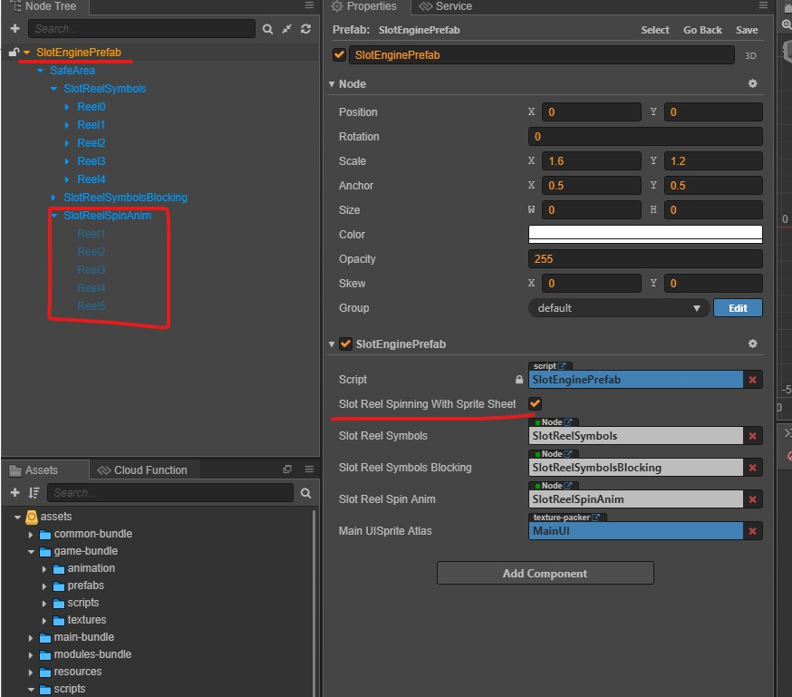

# Slot Reel Animation Type

There is 2 type of slot reel animation

- Sprite sheet animation
- Symbol moving animation

# Slot Symbol Moving Animation

Slot symbol moving methond. The most common methond to create slot spinning effect. Default enabled.

Deactivate `Slot Reel Spinning With Sprite Sheet` option. Super-Template default using slot symbol moving method.

Enable `SlotReelStripPrefab` component for each slot reel. Please make sure _Normal Symbol_ and _Blur Symbol_ assets place in same SpritAtlas.

# Sprite Sheet Animation

Sprite sheet animation using animation to create slot spining effect instead of symbol moving method.
It onyl apply to certain games only.

Make sure setup `SlotReelSpinAnim` animation first and enable `Slot Reel Spinning With Sprite Sheet`
