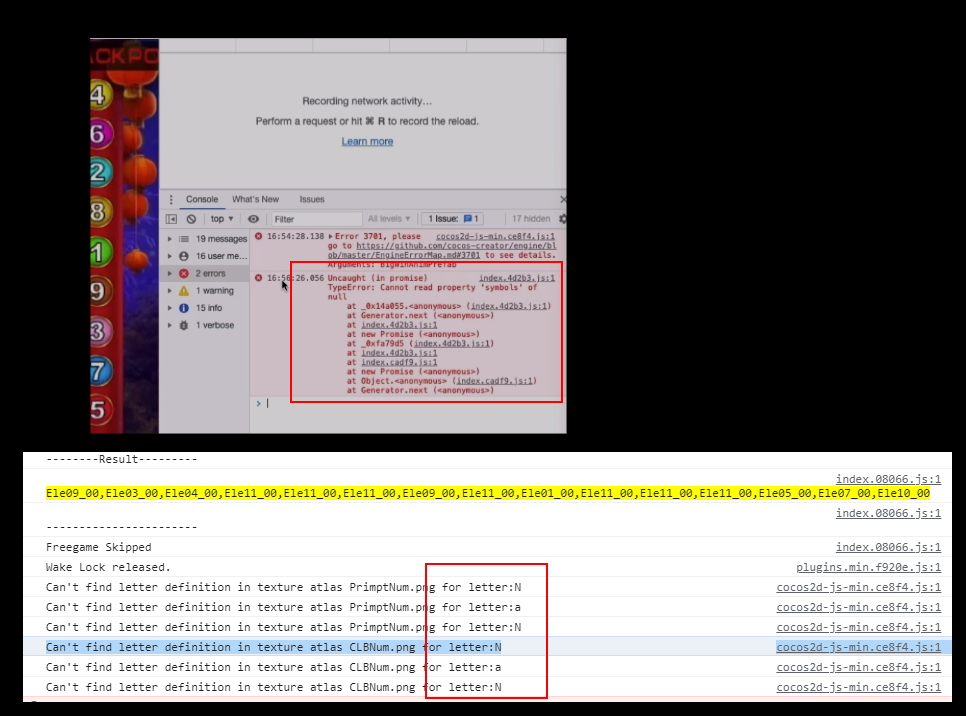
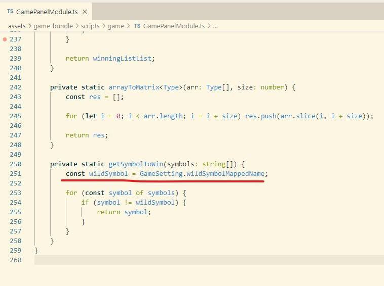
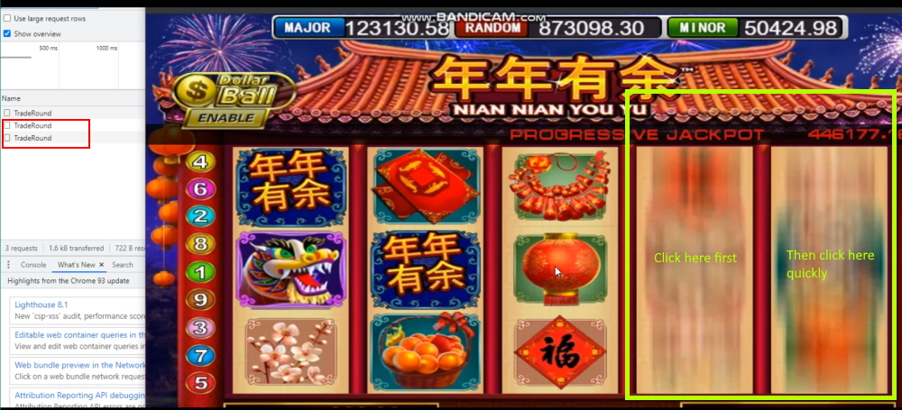

# Minor Hotfix Update (8-September-2021)

- BigWinAnim Script (Mega888 only) on server, if facing any issues on bigwin like hide/show button, sound no stop or close bigwin animation. Can reference files here. [Download](https://github.com/GT3-Game/super-template-update-files/tree/main/others/BigWinAnim/8-August-2021)
- Result wining line return NaN issue [Link](https://github.com/GT3-Game/super-template-outsource/commit/bc8959a065349877869774a12cb0ec4c65691218)
- Duplicate API call [Link](https://github.com/GT3-Game/super-template-outsource/commit/53c7371bbd86779c39d90027ded4bab96346893c)

### BigWinAnim Script on server [Download](https://github.com/GT3-Game/super-template-update-files/tree/main/others/BigWinAnim/8-August-2021)

- BigWinAnim added onBigWinStart and onBigWinEnd

- Added 2 new emit listener

  1. gg.eventManager.on('BigWinAnimPrefab.closeBigWin', this.closeBigWin, this);

     Previous is directly call from gamble, so can change to this

  2. gg.eventManager.on('BigWinAnimPrefab.stopAllSoundEffect', this.stopAllSoundEffect, this);

     use this to stop AllSoundEffect instead of 'HUDPrefab.onWiningLineAndSymbolClear'

### Result wining line return NaN issue [Link](https://github.com/GT3-Game/super-template-outsource/commit/bc8959a065349877869774a12cb0ec4c65691218)

If have any issues similar to this

please update getSymbolToWin function

### Duplicate API call [Link](https://github.com/GT3-Game/super-template-outsource/commit/53c7371bbd86779c39d90027ded4bab96346893c)

It only Happen when using Real API situation

