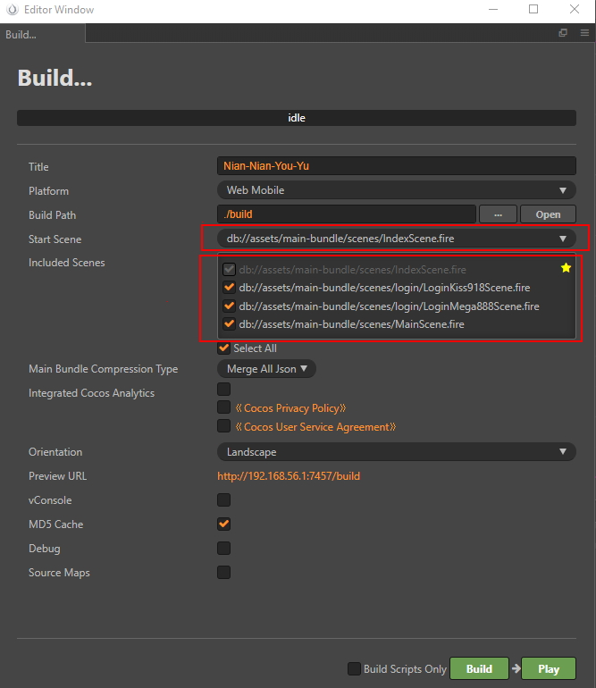

# Super-Template v1.2.0 Release

- Added API interation
- Added Login Page
- Added GameSetting.ts
- Added brand switching handler. URL.com/?br=kiss918 or URL.com/?br=Mega888. Default using Mega.
- Added local testing or real API switching
- Added error message pop up
- Added property to control reel stop speed
- Added cocos_inspector_lite extension
- Added res_compress extension
- Fixed AudioManager cannot resume play SFX after pause
- Fixed HUD balance update problem
- Update GameServer.ts
- Update bet per line paramater passing
- Update last reel spin delay
- Combine same winning line into one
- Bugs fixed

### Added API interation

### Added Login Page

Please setup default preview and build start scene

### Added GameSetting.ts

### Added brand switching handler. URL.com/?br=kiss918 or URL.com/?br=Mega888. Default using Mega.

### Added local testing or real API switching

### Added property to control reel stop speed

can move spin stop sound effect or related changes to here instead of SlotReelStripPrefab.ts

# Added cocos_inspector_lite extension

easy to inspect game and debug UI [More details at store](http://store.cocos.com/app/en/detail/3012)

# Added res_compress extension

Use to compress mp3 [More details at store](http://store.cocos.com/app/detail/2340)

##### Fixed AudioManager cannot resume play SFX after pause [git link](https://github.com/GT3-Game/super-template-outsource/commit/f0238ac95fae0069f80131032936f05b4db6bf55)

##### Fixed HUD balance update problem [git link](https://github.com/GT3-Game/super-template-outsource/commit/8bf1b1b9c02ec7d1b516939df2222bfc9a6bd1e1)

##### Update GameServer.ts [git link](https://github.com/GT3-Game/super-template-outsource/commit/d5733f34c275d808c114d527bd6c8d8297b5aa36)

##### Update bet per line paramater passing [git link](https://github.com/GT3-Game/super-template-outsource/commit/ef370e81af63aa2098002b3c7de227c74b83bbf7)

##### Update last reel spin delay [git link](https://github.com/GT3-Game/super-template-outsource/commit/fdedcbb37d8a4e912180cc574409e4ef2e5a248b)

##### Combine same winning line into one [git link](https://github.com/GT3-Game/super-template-outsource/commit/a0cef156d42e96235421daa3ac0bb9ae6446ed24)
